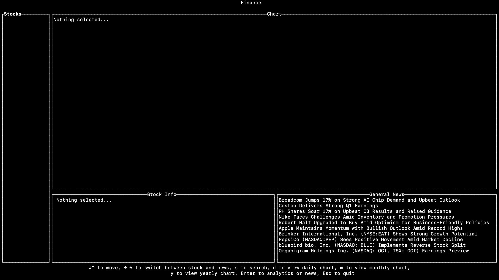
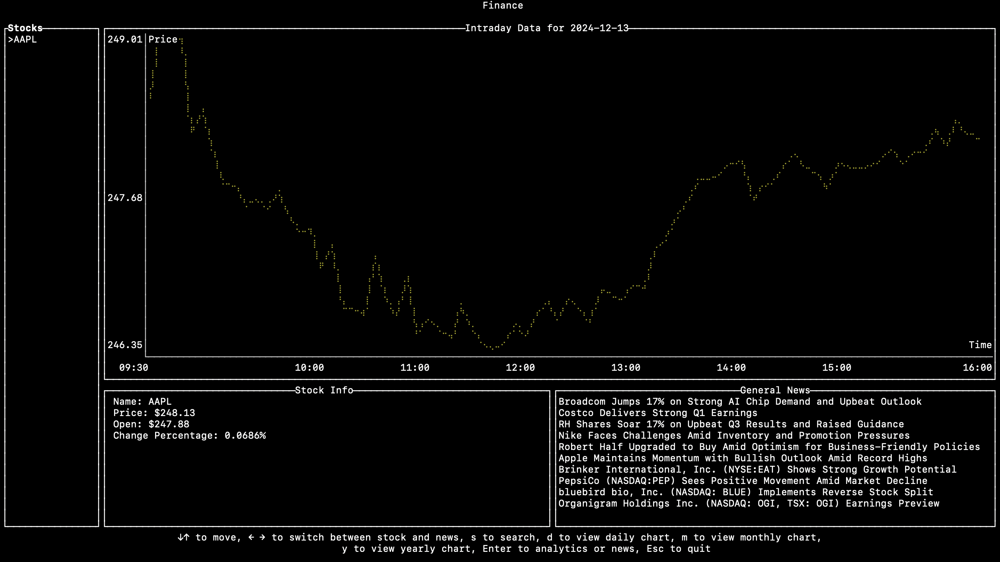
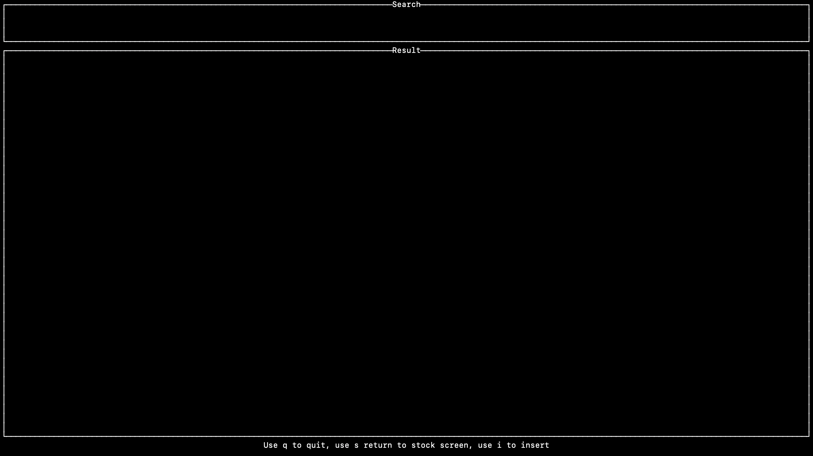

# ECE 1724 Final Project

## Members

**Team Members**:  
Yuanrong Han 1010787409 rexhanh  
Lin Sheng 1010798585 OkayJeff5  
Ziyue Gong 1005710740 ZyeG  

## Motivation
We picked stocks as a project topic because the data is easily available by third party api and we wanted to focus on exploring usage of TUI and programming using rust in general.

We used text user interface (TUI) with a web-served endpoint for a detailed plot, because we wanted to combine the efficiency of TUI with enhanced visualization of web endpoints.

Feature highlights that differentiate our app from others:
- Memorized search history; so users can see previously searched stock without searching and adding to the list when the app restarts. 
- Identified and calculated crossover points for long/short SMA indicators, providing actionable insights for users instead of raw SMA data.

## Objectives

1. Stock Data Display: Provide users with stock prices, intraday, monthly and yearly data.
2. Multi-Screen Navigation: Offer a seamless navigation experience between multiple screens: main screen, search screen, analytics screen and general news screen.
3. User-Friendly Terminal Interface: Leverage Ratatui to create an aesthetically pleasing and intuitive interface.
4. News Integration: Incorporate relevant news articles related to stocks.

## Features

### Feature 1: Main Screen

The home screen. Consists of 4 parts. On the left is a list view of stocks, which initially will be empty until the user adds a stock. On the top right is a view showing stock data in a line chart; users can choose between displaying intraday, monthly, or yearly data. On the bottom left is detailed information of the stock currently chosen. On the bottom right is a list of general news headlines; users can navigate through the list and enter into a detailed view.

**Initial Main Screen**


**Main Screen Chart(After a stock is added)**


### Feature 2: Search Stock Screen

User will be able to search for a stock and add it to the main screen by the company name or stock symbol.


### Feature 3: General News Screen

Display the complete selected news.


### Feature 4: Analytics Screen

Displays issuer/company info, long/short simple moving average of price chart, and top gainer list. 

Enter o to display a detailed view of the SMA chart, with crossover (golden and death) coordinates listed. 
- Golden Cross: shorter crosses above the longer (i.e. the value of the shorter moving average transitions from being below the longer moving average to being above it). A signal to buy.
- Death Cross: opposite, signal to sell.


## User's Guide

### Start & Shutdown
- start: see below Reproducibility Guide
- shutdown: Hit `Esc`

### Main Screen keyboards

Start the app by `cargo run`; you will be directed to the main screen.

The initial main screen will be mostly empty because no stocks have been added. User can hit `s` to enter search screen and add a stock.

If a stock is in the list, you can use the `up` and `down` arrow keys to select different stocks (if more than one stock has been added).

If a stock is selected, you can hit `enter` to enter the analytics screen. Use `d`, `m`, `y` keys to switch between intraday, monthly and yearly chart.

Use `left` and `right` arrow key to switch between the stock list and general news list.

Once a news item is selected, you can hit `enter` to enter general news screen.

You can hit `Esc` to quit the app.

### Search Screen Keyboards

Once in search screen, you can hit `i` to insert text to search for a stock. After finishing the inputs, hit `enter` to search for stocks, and most similar stocks will appear on the screen as a list. User can use `up` and `down` arrow keys to select which stock to add, and hit `enter` to add it to the main screen.

You can hit `h` to return to main screen, or `Esc` to quit the app.

### Analytics Screen Keyboards
- You can hit `o` to view detailed SMA plot, with crossover points marked and annotated.
- You can use ↓↑ to scroll gainer list.
- You can hit `h` to return to main screen, or `Esc` to quit the app.

### General News Screen keyboards

You can hit `h` to return to main screen, or `Esc` to quit the app.

**At the bottom of each screen, there will be an instruction at the bottom.**

## Reproducibility Guide

```sh
git clone https://github.com/rexhanh/1724_final_project.git
cd 1724_final_project/finance
cargo run
```
## Contribution


## Lessons Learned
### limitation of TUI:
The TUI is good for fast rendering and showing trends, making it ideal for quick overviews and real-time monitoring. However, it is limited in providing precise plots and lacks many advanced features offered by more mature libraries, as its visualizations are rendered at the pixel level. To address these limitations, we included a web-served endpoint powered by plotters. This allows users to access detailed, high-quality plots where they can read exact values and extract deeper insights from the data, going beyond the trends displayed in the TUI.

### Error handle with TUI:
Error output to stderr can interfere with the TUI display, causing interruptions. To address this, we configured the fern crate to log errors and info messages to a file (error.log), ensuring the TUI remains unaffected while preserving logs for debugging and tracking.

### Availability of third party data:
The service is reliable during our work with it; but it could be a potential concern. We can have better handling.

Also, during implementation, we noticed some unlisted stock is still available by the service, so a user can search and add such a stock to the list, but the data for plots are missing since it is no longer listed. We added additional logic to display an alert message in this case.

## Video Demo

[](https://www.youtube.com/watch?v=4aPzVM6p3lU)
